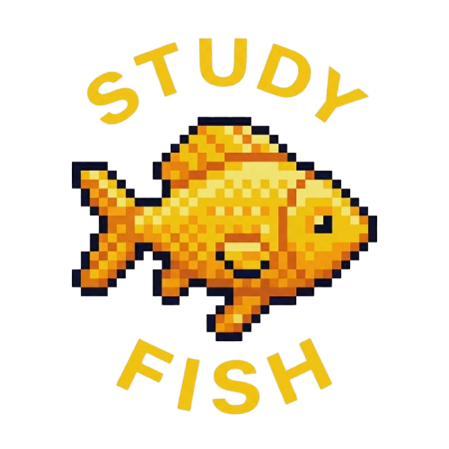

# StudyFish

A Chrome extension that turns study sessions into an ocean adventure. Stay focused, earn sand dollars, and unlock a collection of pixel fish — the longer you study, the rarer the creatures you discover.



---

## Features

### Study Timer
Set a countdown timer and start a focused study session. The timer persists even if you close and reopen the extension popup — so you can't cheat by closing it. Every minute you study earns progress toward unlocking new fish.

### Website Blocker
Add any website to your blocked list. While your timer is running, visiting a blocked site replaces the page with a deep-ocean "abyss" screen, keeping you on track. Remove sites from the list anytime.

### Fish Collection
Unlock 14 unique pixel fish by hitting study time milestones:

| Fish | Minutes Required |
|------|-----------------|
| Blue Fish | 0 min (default) |
| Nemo Fish | 10 min |
| Nemo Fish 2 | 20 min |
| Tuna | 30 min |
| Blue Gold Fish | 60 min |
| Green Yellow Fish | 90 min |
| Golden Fish | 120 min |
| Jellyfish | 240 min |
| Sea Horse | 300 min |
| Light Blue Dolphin | 420 min |
| Dark Blue Dolphin | 480 min |
| Grey Whale | 540 min |
| Shark | 720 min |
| Turtle | 1200 min |

### Fish Tank
Watch your unlocked fish swim around in an animated pixel aquarium. Each session spawns 5 fish with randomized directions and staggered animations.

### Achievements
Earn badges for hitting study milestones — from your first dive to becoming a true ocean dweller.

### Stats
See your total cumulative study time and how many fish you've added to your collection at a glance.

---

## Installation (Developer Mode)

Since StudyFish isn't published to the Chrome Web Store, you load it manually as an unpacked extension.

### Step 1 — Build the extension

Make sure you have [Node.js](https://nodejs.org) installed, then run:

```bash
cd extension
npm install
npm run build
```

This generates a `dist/` folder containing the built extension files.

### Step 2 — Open Chrome Extensions

1. Open Google Chrome
2. Go to `chrome://extensions` in the address bar
3. Toggle **Developer mode** on — the switch is in the top-right corner of the page

### Step 3 — Load the extension

1. Click **Load unpacked**
2. Navigate to and select the `dist/` folder inside the `extension/` directory
3. StudyFish will appear in your extensions list with a fish icon

### Step 4 — Pin it (optional)

Click the puzzle piece icon in the Chrome toolbar, find StudyFish, and click the pin icon so it's always visible.

---

## How to Use

1. **Click the StudyFish icon** in your Chrome toolbar to open the popup.
2. **Set a timer** on the Study tab — enter your desired session length and hit Start.
3. **Add distracting sites** on the Blocked Sites tab (e.g. `youtube.com`, `reddit.com`).
4. Study! Blocked sites will show the abyss screen if you try to visit them.
5. **Check your collection** to see which fish you've unlocked and which are coming next.
6. **View your fish tank** to watch your fish swim around.

---

## Tech Stack

- React 19 + Vite
- Chrome Extension Manifest V3
- Chrome Storage API (local persistence)
- CSS3 keyframe animations
- Pixel art assets + LowresPixel custom font
